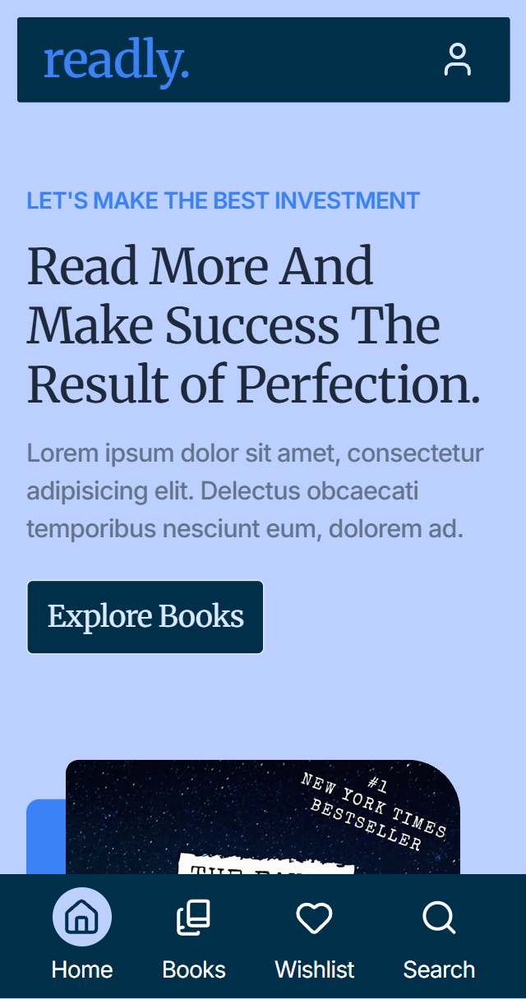

# 📚 MERN - Readly

**Readly** is my first **full-stack** project built with the MERN stack and TypeScript.
It’s a complete web application that allows users to explore, search, and filter a vast collection of books, while offering personalized features such as authentication, favorites management, and a smooth browsing experience. For administrators, Readly provides a dedicated dashboard where they can add, edit, and delete books through a clean CRUD interface. 

Mainly, the goal was to create another **Front-End** React / Next.js project using exploiting a books public / free API. I didn't find it, so I decided to create my own APIs! I started watching some **Express** tutorials on YouTube which lead me to learn its basics and how to implement security middlwares like CORS and Helmet. Then, I finally started the Front-End, using my stack **React**, **TypeScript**, and **TailwindCSS**, and I decided to use **Zustand** as State Management, since it's light and powerful at the same time!

This project allowed me to combine **frontend** and **backend** knowledge into a full-stack app, implementing:

- 🎨 Modern and responsive UI/UX with React, TypeScript and TailwindCSS;
- 🐻 State management with Zustand;
- ⚡ REST API built in Express + TypeScript;
- 🍃 MongoDB integration for scalable data storage;
- 🔐 Authentication & authorization for users and admins;
- 🛠️ A simply admin panel for managing the books catalog.

---

## 🛠️ Front-End Techs

---

## 🛠️ Back-End Techs

---

## ✨ Features

- 🔒 Authentication & Authorization – Secure login/registration with JWT, HTTP-only cookies and custom auth middlewares.
- 🛡️ Security – Implemented with CORS, Helmet, password hashing and secure cookie handling.
- 📚 Browse & Search – Explore a vast collection of books with advanced filters, categories and full-text search.
- ⭐ Favorites – Users can save and manage their favorite books.
- 🛠️ Admin Panel – Admins can add, update, and delete books with a dedicated dashboard (full CRUD operations).
- 📱 Responsive UI – Fully optimized for both desktop and mobile devices.
- ⚡ Fast & Scalable – REST API built with Express + TypeScript and a MongoDB database.

---

## 📸 Screenshots

